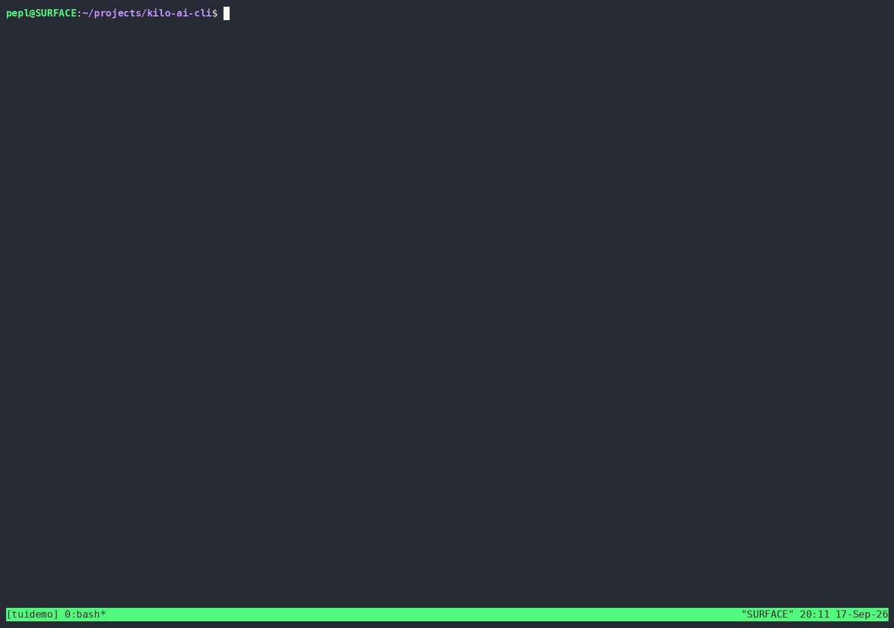

# kilo-ai-cli

[](https://github.com/ThePlenkov/kilo-ai-cli/actions/workflows/ci.yml)
[](https://www.npmjs.com/package/kilo-ai-cli)
[](https://nodejs.org)
[](packages/cli/LICENSE)

A command-line interface for the [kilo.ai](https://kilo.ai) cloud platform. Authenticate via browser, manage sessions and organizations, inspect coding plans and usage, run KiloClaw instances, trigger code reviews, browse usage analytics, deploy apps, and operate the personal Security Agent — all from your terminal.

- **Auth** — OAuth 2.0 Device Authorization Grant (browser-based login, persisted credentials)
- **Profile & Balance** — view your profile, credit balance, and active organization
- **Sessions** — list, inspect, and rename cloud CLI sessions
- **Organizations** — list, switch, create, update, manage members, seats, usage, credits, invoices, models, and security
- **Coding Plans** — view subscriptions and usage quotas (windows, remaining percent, resets)
- **BYOK** — list bring-your-own-key entries
- **KiloClaw** — manage instances, billing, subscriptions, changelog, versions, file trees, run lifecycle
- **Cloud Agent** — inspect sessions and connected GitHub/GitLab repositories
- **Code Reviews** — list reviews, view/toggle/set-model review-agent configuration (personal + org)
- **Usage Analytics** — summary, timeseries, breakdown, and table views
- **App Builder** — list apps, check eligibility, deploy
- **Security Agent** — enable/disable, list repos and findings, view finding details, stats, dashboard, sync, dismiss, analyze, remediate, retry/cancel remediation, list commands, orphaned repos, last sync, bulk delete findings
- **TUI** — website-style interactive terminal UI covering all areas, with mutations (Ink/React)

---

## Demo

<p align="center">
  
</p>

Interactive TUI (`kilo-ai-cli tui`): sidebar navigation, live session table, security findings with repository/severity filters, server-side sort, column picker, finding details, stats, and dashboard. The demo above runs against a local fixture server, so it can be regenerated safely — see [`docs/demo.tape`](docs/demo.tape).

---

## Table of Contents

- [Requirements](#requirements)
- [Install](#install)
- [Quick Start](#quick-start)
- [Authentication](#authentication)
- [Configuration](#configuration)
- [Commands](#commands)
  - [auth](#auth)
  - [profile](#profile)
  - [balance](#balance)
  - [sessions](#sessions)
  - [org](#org)
  - [plans](#plans)
  - [byok](#byok)
  - [kiloclaw](#kiloclaw)
  - [cloud-agent](#cloud-agent)
  - [reviews](#reviews)
  - [analytics](#analytics)
  - [app-builder](#app-builder)
  - [security](#security)
  - [tui](#tui)
- [Demo](#demo)
- [Interactive TUI Mode](#interactive-tui-mode)
- [Environment Variables](#environment-variables)
- [Credential Storage](#credential-storage)
- [Exit Codes](#exit-codes)
- [Development](#development)
- [Tech Stack](#tech-stack)
- [Architecture](#architecture)
- [Contributing](#contributing)
- [License](#license)

---

## Requirements

- **Node.js** `>= 24.21.0` (LTS recommended)
- A kilo.ai account (sign up at [kilo.ai](https://kilo.ai))

The CLI uses native TypeScript type stripping (no transpilation step at runtime), ESM modules, and modern Node.js APIs. Older Node.js versions are not supported.

---

## Install

### From npm (when published)

```bash
# Global install
npm install -g kilo-ai-cli

# Or run ad-hoc without installing
npx kilo-ai-cli auth login
```

### From source (development)

```bash
git clone --recurse-submodules https://github.com/ThePlenkov/kilo-ai-cli.git
cd kilo-ai-cli

# Install dependencies
npm install

# Build the .nx-devkit submodule plugins (required for Nx)
cd .nx-devkit
bun install --frozen-lockfile --ignore-scripts
bun run build
cd ..

# Build the CLI
npx nx build kilo-ai-cli

# Run the built CLI
node packages/cli/dist/index.mjs --help

# Or run directly from source (native TS execution)
node packages/cli/src/index.ts --help
```

---

## Quick Start

```bash
# 1. Authenticate (opens browser)
kilo-ai-cli auth login

# 2. Check your profile and balance
kilo-ai-cli profile
kilo-ai-cli balance

# 3. List your cloud sessions
kilo-ai-cli sessions list

# 4. List organizations and switch
kilo-ai-cli org list
kilo-ai-cli org set <org-id>

# 5. View coding plan usage
kilo-ai-cli plans list
kilo-ai-cli plans usage <subscription-id>

# 6. Explore the security agent
kilo-ai-cli security status
kilo-ai-cli security findings
kilo-ai-cli security dashboard

# 7. Launch the interactive TUI
kilo-ai-cli tui
```

---

## Authentication

The CLI uses the **OAuth 2.0 Device Authorization Grant** flow. When you run `kilo-ai-cli auth login`:

1. The CLI requests a device code from the Kilo API.
2. It prints a verification URL and a user code to the terminal.
3. You open the verification URL in your browser and enter the code.
4. The CLI polls the API until you authorize the request.
5. The resulting token is stored locally at `~/.kilo/credentials.json`.
6. Subsequent commands read the token automatically.

Tokens are long-lived (1 year). To re-authenticate, run `kilo-ai-cli auth login` again. To clear credentials, run `kilo-ai-cli auth logout`.

```bash
kilo-ai-cli auth login     # Authenticate via browser
kilo-ai-cli auth logout    # Clear stored credentials
kilo-ai-cli auth status    # Show current authentication status
```

---

## Configuration

The CLI reads configuration from environment variables and a local credentials file. No config file is required for basic usage.

### Environment Variables

| Variable | Default | Description |
|----------|---------|-------------|
| `KILO_API_URL` | `https://api.kilo.ai` | Base URL for the Kilo API |
| `KILO_SESSION_INGEST_URL` | `https://ingest.kilosessions.ai` | Session ingest endpoint |
| `KILO_CLI_VERSION` | package version | Version reported in User-Agent (overrides the default) |

### Credential Storage

Credentials are stored at `~/.kilo/credentials.json` with the following shape:

```json
{
  "type": "oauth",
  "access": "<jwt>",
  "refresh": "<refresh-token>",
  "expires": 1760000000000,
  "accountId": "user-123"
}
```

The file is created with `0600` permissions. Do not commit this file or share it.

---

## Commands

All commands support `--help` / `-h` for inline usage. Parent commands (e.g. `kilo-ai-cli security`) show a list of available subcommands when invoked without arguments or with `--help`.

### auth

```text
kilo-ai-cli auth login      # Authenticate with kilo.ai via browser
kilo-ai-cli auth logout     # Clear stored credentials
kilo-ai-cli auth status     # Show authentication status
```

### profile

```text
kilo-ai-cli profile         # Show your profile and active organization
```

### balance

```text
kilo-ai-cli balance         # Show your credit balance
```

### sessions

```text
kilo-ai-cli sessions list                    # List cloud CLI sessions
kilo-ai-cli sessions get <id>                # Get details of a session
kilo-ai-cli sessions rename <id> <title>     # Rename a session
```

### org

Organization management. Some subcommands require an active organization (set via `org set`).

`<id>` can be either the organization UUID (from `org list`) or the organization name.

```text
kilo-ai-cli org list                        # List organizations you belong to
kilo-ai-cli org set <id>                    # Set the active organization
kilo-ai-cli org members <id>               # List members of an organization
kilo-ai-cli org usage <id>                  # Show usage for an organization
kilo-ai-cli org credits <id>               # Show credits for an organization
kilo-ai-cli org seats <id>                 # Show seats for an organization
kilo-ai-cli org invoices <id>              # List invoices for an organization
kilo-ai-cli org create                     # Create a new organization
kilo-ai-cli org update <id>                # Update organization settings
kilo-ai-cli org models <id>                # List available models for an organization
kilo-ai-cli org security <id>              # Show security settings for an organization
```

### plans

```text
kilo-ai-cli plans list               # List coding plan subscriptions
kilo-ai-cli plans usage <sub-id>     # Show usage for a subscription (windows, remaining %, resets)
```

### byok

```text
kilo-ai-cli byok list                # List bring-your-own-key entries
```

### kiloclaw

Manage KiloClaw managed instances.

```text
kilo-ai-cli kiloclaw instances                   # List instances
kilo-ai-cli kiloclaw billing                       # Show billing info
kilo-ai-cli kiloclaw billing-history <instance-id> # Show billing history for an instance
kilo-ai-cli kiloclaw subscriptions                 # List subscriptions
kilo-ai-cli kiloclaw subscription <id>             # Show subscription details
kilo-ai-cli kiloclaw changelog                     # Show changelog
kilo-ai-cli kiloclaw version                       # Show version info
kilo-ai-cli kiloclaw file-tree <instance>          # Show file tree for an instance
kilo-ai-cli kiloclaw run-start <instance>          # Start a run
kilo-ai-cli kiloclaw run-status <instance>         # Show run status
kilo-ai-cli kiloclaw run-cancel <instance>         # Cancel a running job
kilo-ai-cli kiloclaw unpin <instance>             # Unpin an instance
```

### cloud-agent

```text
kilo-ai-cli cloud-agent session                    # Show cloud agent session info
kilo-ai-cli cloud-agent github-repos              # List connected GitHub repositories
kilo-ai-cli cloud-agent gitlab-repos              # List connected GitLab repositories
```

### reviews

The review agent has **personal** and **organization** scopes: pass the platform (`github`/`gitlab`) alone for personal, or an org ID plus platform (or `--org <id>`) for an organization.

```text
kilo-ai-cli reviews list                          # List your personal code reviews
kilo-ai-cli reviews list --org <org-id>           # List code reviews for an organization
kilo-ai-cli reviews get <id>                      # Show a review with attempts and token usage
kilo-ai-cli reviews config <platform>             # Personal review-agent config
kilo-ai-cli reviews config <org> <platform>       # Org review-agent config (or --org <id> <platform>)
kilo-ai-cli reviews toggle <platform> --enabled <bool>       # Toggle personal review agent
kilo-ai-cli reviews toggle <org> <platform> --enabled <bool> # Toggle org review agent
kilo-ai-cli reviews set-model <platform> <slug>   # Set review-agent model (personal; --org for org)
```

### analytics

```text
kilo-ai-cli analytics summary                      # Show usage summary
kilo-ai-cli analytics timeseries                   # Show usage over time
kilo-ai-cli analytics breakdown                    # Show usage breakdown by dimension
kilo-ai-cli analytics table                         # Show usage in table format
```

### app-builder

```text
kilo-ai-cli app-builder list                       # List apps
kilo-ai-cli app-builder eligibility                # Check deployment eligibility
kilo-ai-cli app-builder deploy                     # Deploy an app
```

### security

The Security Agent operates at the **personal level** — no organization context is required. It monitors your repositories for security findings (vulnerabilities, license issues, etc.) and can automatically remediate them.

```text
# Status & configuration
kilo-ai-cli security status                        # Show permission status
kilo-ai-cli security config                        # Show security agent configuration
kilo-ai-cli security enable                        # Enable the security agent
kilo-ai-cli security disable                       # Disable the security agent

# Repositories
kilo-ai-cli security repos                          # List monitored repositories
kilo-ai-cli security orphaned-repos                # List orphaned repositories
kilo-ai-cli security sync                           # Trigger a security sync
kilo-ai-cli security last-sync                     # Show last sync time

# Findings
kilo-ai-cli security findings list [options]        # List findings
kilo-ai-cli security findings detail <id>           # Get finding details
kilo-ai-cli security findings dismiss <id> --reason <r>  # Dismiss a finding (one-way; reason:
                                                    #  fix_started/no_bandwidth/tolerable_risk/inaccurate/not_used)
kilo-ai-cli security findings close [filters] --reason <r>  # Bulk-dismiss matching findings (counts reported)
kilo-ai-cli security findings delete <repo>         # Delete all findings for a repo (interactive)
kilo-ai-cli security findings delete <repo> --yes   # Delete without confirmation prompt
# <repo> can be a numeric repository ID (from `security repos`) or a full name like `user/repo`.
# Both `close` and `delete` accept --repo plus the `list` filters
# --severity/--status/--outcome/--overdue, and support --dry-run/--yes.

# Analysis & remediation
kilo-ai-cli security findings analyze <id>           # Queue codebase analysis for a finding
kilo-ai-cli security findings remediate <id>         # Start remediation for a finding (may open a PR)
kilo-ai-cli security findings retry <id>             # Retry remediation for a finding
kilo-ai-cli security findings cancel <attempt-id>    # Cancel a running remediation attempt

# Stats & dashboard
kilo-ai-cli security stats                           # Show security agent statistics
kilo-ai-cli security dashboard                      # Show dashboard stats

# Commands
kilo-ai-cli security commands                        # List active security agent commands
kilo-ai-cli security command <id>                    # Get status of a specific command
```

#### `security findings list` options

| Flag | Type | Description |
|------|------|-------------|
| `--repo` | string | Filter by repository full name (e.g. `user/repo`) |
| `--severity` | string | Filter by severity: `critical` / `high` / `medium` / `low` / `info` |
| `--status` | string | Filter by status: `open` / `dismissed` / `remediated` / `in_progress` |
| `--outcome` | string | Filter by remediation outcome |
| `--overdue` | boolean | Only show overdue findings |
| `--sort` | string | Sort: `severity_desc` (default), `severity_asc`, `sla_due_at_asc` |
| `--limit` | string | Max findings to show (1–100, default `50`) |
| `--offset` | string | Pagination offset (default `0`) |
| `--columns` | string | Columns to show: `id,severity,title,repo,status,package` or `all` (default: no `id`) |

Output includes a summary (total, running, concurrency) followed by a table with severity (color-coded), title, repository (clickable hyperlink), status (color-coded), and package columns. Use `--columns all` to include the `id` column.

#### `security findings detail <id>` output

Shows full finding details: severity, title, repository, status, source, description, package (with ecosystem), vulnerable version range, patched version, CVE, GHSA, CVSS score, SLA due date, analysis status, remediation summary, created/updated timestamps.

### tui

```text
kilo-ai-cli tui                                    # Launch interactive TUI for the security agent
```

---

## Interactive TUI Mode

The `tui` command launches a full-screen interactive terminal UI built with [Ink](https://github.com/vadimdemedes/ink) (React for CLIs). It mirrors the website's navigation as a sidebar on the left with a content pane on the right:

- **Dashboard** — profile, balance, organizations
- **Cloud** — sessions (detail + rename), cloud-agent repos, session lookup, code reviews, **review-agent config** (platform switch, model edit, personal/org toggle), app builder
- **Security** — findings (**R**=repo filter, **f**=severity, **s**=status, **o**=sort, **c**=columns, **n**/**p**=page; detail with **d**=dismiss / **r**=remediate + confirm), repositories, stats, dashboard, commands, config, permissions
- **Usage** — analytics summary/timeseries/breakdown/table, coding plans
- **KiloClaw** — instances, agents, billing, history, subscriptions, changelog, version, files
- **Organizations** — org list with members/usage/credits/seats/invoices/models/security detail
- **Account** — BYOK keys

Keys: **↑/↓** move in the focused pane, **Enter/→** open the selected screen, **Esc** go back (from a nested screen to the parent, from a root screen back to the sidebar), **q** quits while the sidebar is focused. Refresh is screen-specific — most list and record screens use **r**, while session detail uses **r** to rename and **R** to refresh. Mutating keys confirm first (press the key twice, or **Esc** to cancel): `d`/`r` on a finding (dismiss additionally lets digits `1`–`5` pick the reason), `t` on the review-agent screen (`m` opens the model editor immediately). The hint line at the bottom of each screen shows its actual keys. The layout adapts to the terminal size: the sidebar scrolls when it doesn't fit and lists show `↑/↓ N more` markers.

---

## Environment Variables

```bash
# Override the API base URL (e.g. for self-hosted or staging)
export KILO_API_URL=https://staging.api.kilo.ai

# Override the session ingest URL
export KILO_SESSION_INGEST_URL=https://staging.ingest.kilosessions.ai

# Override the CLI version reported in User-Agent
export KILO_CLI_VERSION=1.0.0
```

---

## Credential Storage

| OS | Path |
|----|------|
| Linux / macOS | `~/.kilo/credentials.json` |
| Windows | `%USERPROFILE%\.kilo\credentials.json` |

The file is created with `0600` permissions (owner read/write only). If the file is removed, the CLI will prompt for re-authentication on the next command.

---

## Exit Codes

| Code | Meaning |
|------|---------|
| `0` | Success |
| `1` | General error (invalid input, API error, not authenticated) |

Errors are printed to `stderr`. The CLI exits non-zero on any failure.

---

## Development

### Prerequisites

- Node.js `>= 24.21.0`
- [Bun](https://bun.sh) (for building the `.nx-devkit` submodule)
- [Nx](https://nx.dev) (installed via `npm install`)

### Build

```bash
# Build the .nx-devkit submodule plugins (first time only)
cd .nx-devkit
bun install --frozen-lockfile --ignore-scripts
bun run build
cd ..

# Build the CLI (tsdown bundles to packages/cli/dist/index.mjs)
npx nx build kilo-ai-cli
```

### Test

```bash
npx nx test kilo-ai-cli        # Run vitest
```

### Live API smoke test

`packages/cli/scripts/live-smoke.ts` catalogues every CLI command and executes all read/idempotent ones against the real API, writing a coverage matrix to `LIVE-MATRIX.md`:

```bash
node packages/cli/scripts/live-smoke.ts                     # read + reversible idempotent commands
node packages/cli/scripts/live-smoke.ts --include-manual    # also side-effecting commands (org create, analyze, remediate…)
```

Idempotent mutations restore state after themselves (credentials, org names, toggles). Commands that spend credits, open PRs, or delete data stay `manual`/`never` — run `--include-manual` only on an account where that's acceptable.

### Typecheck

```bash
npx nx typecheck kilo-ai-cli   # tsc --noEmit
```

### Lint

```bash
npx nx lint kilo-ai-cli        # oxlint
```

### Format

```bash
npx nx format kilo-ai-cli      # biome check --write
```

### Run from source

The CLI supports native TypeScript execution — no build step needed for development:

```bash
node packages/cli/src/index.ts auth login
node packages/cli/src/index.ts security findings
```

### Project structure

```text
kilo-ai-cli/
├── packages/
│   └── cli/
│       ├── src/
│       │   ├── api/            # API client, tRPC helpers, types
│       │   ├── auth/           # Device auth flow, token store
│       │   ├── commands/       # CLI command handlers (citty)
│       │   ├── tui/            # Interactive TUI (Ink/React)
│       │   ├── cli.ts          # Command tree
│       │   └── index.ts        # Entry point
│       ├── test/               # Vitest tests
│       ├── package.json
│       ├── tsconfig.json
│       └── tsdown.config.ts
├── .nx-devkit/                 # Nx TypeScript plugin submodule
├── .github/workflows/          # CI/CD
├── docs/                       # Design docs
├── nx.json
└── package.json
```

---

## Tech Stack

| Tool | Purpose |
|------|---------|
| [TypeScript 7](https://www.typescriptlang.org/) | Language (native type stripping, ESM) |
| [Node.js](https://nodejs.org/) `>= 24.21.0` | Runtime (LTS) |
| [tsdown](https://github.com/sxzz/tsdown) | Build / bundle |
| [Vitest](https://vitest.dev/) | Test framework |
| [Oxlint](https://oxc.rs/docs/guide/usage/linter) | Linter |
| [Biome](https://biomejs.dev/) | Formatter |
| [Citty](https://github.com/unjs/citty) | CLI framework |
| [Zod](https://zod.dev/) | Schema validation |
| [Ink](https://github.com/vadimdemedes/ink) + [React](https://react.dev/) | Interactive TUI |
| [Nx](https://nx.dev/) + [@nx-devkit](https://github.com/nx-devkit/nx.ts) | Monorepo (zero-config inference plugins) |

---

## Architecture

The CLI is a single-package Nx monorepo workspace. The `packages/cli` package contains all source code. The `.nx-devkit` submodule provides Nx TypeScript plugins for zero-config inference (tsdown, vitest, oxlint, biome, tsc).

### API layer

- `src/api/client.ts` — generic `trpcQuery` / `trpcMutate` helpers with Zod validation, size limits, timeout, and typed errors
- `src/api/trpc.ts` — typed procedure wrappers for each Kilo Cloud router
- `src/api/types.ts` — TypeScript interfaces mirroring the Kilo Cloud schema
- `src/api/constants.ts` — API base URL, headers, polling intervals
- `src/api/headers.ts` — auth header builder (Bearer token, organization, editor)

### Auth layer

- `src/auth/device-auth.ts` — OAuth 2.0 Device Authorization Grant flow
- `src/auth/token-store.ts` — file-based credential store (`~/.kilo/credentials.json`)

### Command layer

- `src/commands/*.ts` — one file per command group (auth, profile, sessions, org, plans, byok, kiloclaw, cloud-agent, reviews, analytics, app-builder, security-agent, tui)
- `src/commands/format.ts` — shared table/summary formatting helpers
- `src/commands/theme.ts` — shared color scheme and OSC 8 hyperlink helpers
- `src/commands/confirm.ts` — interactive confirmation prompt
- `src/cli.ts` — command tree wiring

### TUI layer

- `src/tui/App.tsx` — root Ink component
- `src/tui/views/*.tsx` — individual views (Menu, Dashboard, FindingsList, FindingDetail, Stats)

See [docs/DESIGN.md](docs/DESIGN.md) for the full design document.

---

## Contributing

Contributions are welcome via pull requests to the [`ThePlenkov/kilo-ai-cli`](https://github.com/ThePlenkov/kilo-ai-cli) repository.

1. Fork the repository.
2. Create a feature branch: `git checkout -b feat/my-feature`.
3. Make your changes following the existing conventions.
4. Run the full verification suite:
   ```bash
   npx nx typecheck kilo-ai-cli
   npx nx lint kilo-ai-cli
   npx nx test kilo-ai-cli
   npx nx build kilo-ai-cli
   ```
5. Open a pull request against `main`.

### Conventions

- Source files use `.ts` / `.tsx` extensions.
- Relative imports include the `.ts` extension.
- ESM only (`"type": "module"`).
- No enums, parameter properties, or namespaces.
- `verbatimModuleSyntax: true`, `isolatedDeclarations: true`.
- Type-only imports use `import type`.
- Follow [TDD](https://en.wikipedia.org/wiki/Test-driven_development): write a failing test, implement the minimum change, verify.

---

## License

[MIT](LICENSE)
